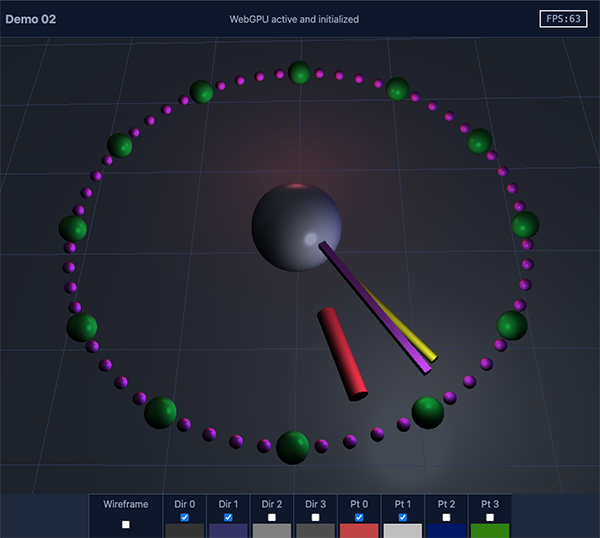

# shaders-mono

See the live [demos here](https://micurs.github.io/shaders-mono/).

## Demo 1


[Open the demo](https://micurs.github.io/shaders-mono/demo-01.html).

## Demo 2

A simple example with realtime animation of a 3D clock.



[Open the demo](https://micurs.github.io/shaders-mono/demo-02.html).

## Demo 3

A simple integration with [Oimo.js 3d physics engine](https://github.com/lo-th/Oimo.js/).


[Open the demo](https://micurs.github.io/shaders-mono/demo-03.html).

## Development

This mono repo is managed with NX and use `pnpm` as package manager.

So first thing run `pnpm install` to get all the dependencies.

Then you can run the main scripts from the root folder of this project to build the code:

* `pnpm build:all`: Build all the projects in the repo. Nx will intelligently order the build process based on the dependency graph.
* `pnpm build:shared`: Builds only the shared libraries in the repo (projects under `shared`).
* `pnpm build:demo`: Builds the current main demo project.

To run the demo apps you can `cd` to any `demos` subfolder and run the `dev` script defined in each `package.json`

For example:

```
cd demos/demo-02
pnpm dev
```

From the root you can run the latest demo by invoking

```
pnpm dev:demo
```

### Monorepo