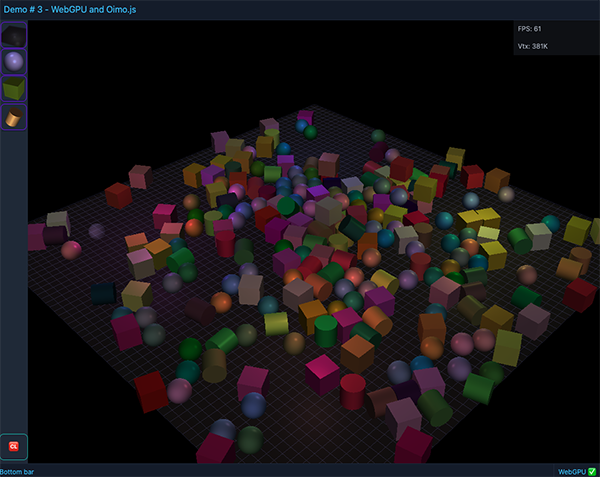

# shaders-mono

Welcome to the "shaders-mono" project, an evolving exploration into the realms of WebGPU API and geometric programming using TypeScript.

At the heart of this project lies two core libraries housed within the shared folder: "geopro" and "webgpu."
The "geopro" library is dedicated to 'coordinate-free' geometric programming, providing a robust toolkit for handling and manipulating geometric data and algorithms in a way that abstracts away the complexities of traditional coordinate systems.

Parallel to "geopro," the "webgpu" library represents a forward-thinking endeavor in the realm of WebGPU technology.
This library is not just an accumulation of shader programming techniques; it's an ongoing attempt to streamline WebGPU programming.

We are not trying to replicate the abstractions found in other libraries built on top of low-level graphics APIs.
Instead, the focus is on creating a more intuitive and accessible interface for WebGPU, aiming to unlock the full potential of this modern API while avoiding the complexities and limitations imposed by previous models.

By exploring innovative approaches and prioritizing a simplified user experience, this library serves as a foundational tool for developers venturing into the intricate world of WebGPU, providing an environment where creativity and efficiency coexist.


See the live [demos here](https://micurs.github.io/shaders-mono/).

## Demo 1


[Open the demo](https://micurs.github.io/shaders-mono/demo-01.html).

## Demo 2

A simple example with realtime animation of a 3D clock.


[Open the demo](https://micurs.github.io/shaders-mono/demo-02.html).

## Demo 3

A simple integration with [Oimo.js 3d physics engine](https://github.com/lo-th/Oimo.js/).



[Open the demo](https://micurs.github.io/shaders-mono/demo-03.html).

## Development

This mono repo is managed with NX and use `pnpm` as package manager.

So first thing run `pnpm install` to get all the dependencies.

Then you can run the main scripts from the root folder of this project to build the code:

* `pnpm build:all`: Build all the projects in the repo. Nx will intelligently order the build process based on the dependency graph.
* `pnpm build:shared`: Builds only the shared libraries in the repo (projects under `shared`).
* `pnpm build:demo`: Builds the current main demo project.

To run the demo apps you can `cd` to any `demos` subfolder and run the `dev` script defined in each `package.json`

For example:

```
cd demos/demo-02
pnpm dev
```

From the root you can run the latest demo by invoking

```
pnpm dev:demo
```

### License

This project is licensed under the MIT License - see the [LICENSE](license.txt) file for details.

